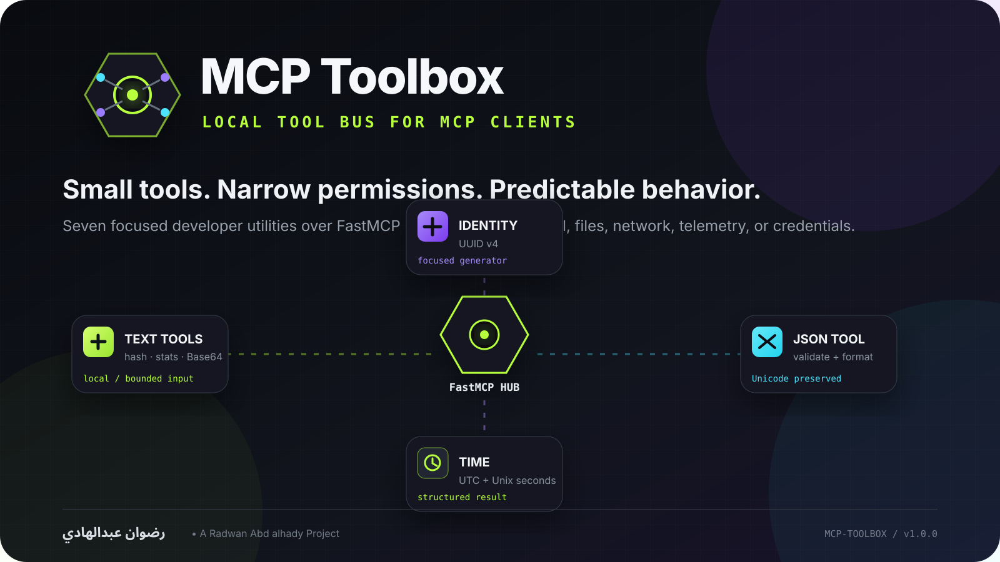
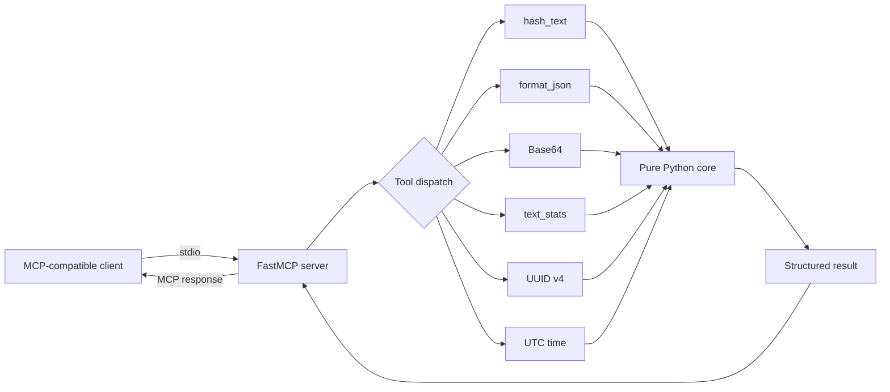

<p align="center">
  
</p>

<p align="center">
  
</p>

<h1 align="center">MCP Toolbox</h1>

<p align="center">
  A compact local Model Context Protocol server that exposes focused developer utilities without filesystem access, shell execution, network calls, telemetry, or credentials.
</p>

<p align="center">
  <a href="https://github.com/rad03i2/mcp-toolbox/actions/workflows/ci.yml"></a>
  
  
  
  
</p>

<p align="center">
  <a href="#overview">Overview</a> ·
  <a href="#tool-catalog">Tools</a> ·
  <a href="#quick-start">Quick start</a> ·
  <a href="#architecture">Architecture</a> ·
  <a href="#security-model">Security</a> ·
  <a href="#العربية">العربية</a>
</p>

---

## Overview

**MCP Toolbox** is a small Python server for MCP-compatible AI clients. It provides a set of deterministic or tightly scoped developer utilities through the official Python MCP SDK / FastMCP layer while keeping the actual tool logic in a separately testable core module.

The project exists for operations that are too small to justify a remote service or broad machine access: formatting JSON, hashing text, Base64 conversion, counting text, generating a UUID, or reading the current UTC time.

### Design goals

- **Local-first** — the current tools do not call external services.
- **Narrow permissions** — no filesystem reads/writes, shell commands, database access, or arbitrary network requests.
- **Small surface area** — seven focused tools rather than a general-purpose execution environment.
- **Directly testable core** — utility behavior is separated from MCP transport wiring.
- **Explicit limits** — text-processing inputs are capped at 1,000,000 characters.

## Tool catalog

| MCP tool | What it does | Notes |
| --- | --- | --- |
| `hash_text` | Hash UTF-8 text | SHA-256 / SHA-512; SHA-1 / MD5 only for legacy checksum compatibility |
| `format_json` | Validate and pretty-print JSON | Preserves Unicode; indentation range 0–8 |
| `base64_encode` | Encode UTF-8 text as Base64 | Text only |
| `base64_decode` | Strictly decode Base64 to UTF-8 | Rejects malformed Base64 and non-UTF-8 bytes |
| `text_stats` | Count characters, words, lines and UTF-8 bytes | Includes non-whitespace character count |
| `new_uuid` | Generate UUID v4 | Random by design |
| `utc_now` | Return current UTC time | ISO-8601 plus Unix seconds |

> Base64 is an encoding, not encryption. For integrity-sensitive hashing, prefer SHA-256 or SHA-512.

## How it fits together



The MCP layer in `server.py` is intentionally thin. Validation and utility behavior live in `core.py`, which makes the core reusable without running an MCP server.

## Quick start

### Requirements

- Python **3.10+**
- An MCP-compatible client
- The Python `mcp` package is installed through the project dependency

### Install

```bash
git clone https://github.com/rad03i2/mcp-toolbox.git
cd mcp-toolbox
python -m venv .venv
```

Activate the environment:

```bash
# Windows
.venv\Scripts\activate

# Linux / macOS
source .venv/bin/activate
```

Then install:

```bash
python -m pip install -e .
```

## MCP client configuration

A generic stdio example is included in [`examples/client-config.json`](examples/client-config.json):

```json
{
  "mcpServers": {
    "toolbox": {
      "command": "mcp-toolbox",
      "args": []
    }
  }
}
```

The exact configuration location depends on the client. If the client cannot resolve `mcp-toolbox`, use the absolute path to the executable inside the virtual environment.

## Example requests

Once connected, an MCP client can request operations such as:

```text
Use format_json on this JSON with indent 2.
Use hash_text to calculate SHA-256 for this text.
Use text_stats on this paragraph.
Generate a UUID v4 with new_uuid.
Return the current UTC time with utc_now.
```

### Direct Python API

The same core functions are reusable without MCP:

```python
from mcp_toolbox import format_json, hash_text, text_stats

print(hash_text("hello"))
print(format_json('{"city":"الموصل","ok":true}'))
print(text_stats("Hello مرحبا"))
```

## Architecture

```text
mcp-toolbox/
├─ src/mcp_toolbox/
│  ├─ __init__.py        # public core API + package metadata
│  ├─ core.py            # validation and utility implementations
│  └─ server.py          # FastMCP declarations + stdio entry point
├─ tests/
│  └─ test_core.py       # unittest coverage for the core behavior
├─ examples/
│  └─ client-config.json # generic MCP client configuration
├─ assets/               # repository visual identity
├─ docs/
│  ├─ ARCHITECTURE.md    # design and trust-boundary notes
│  └─ BRAND.md           # visual identity guide
└─ .github/workflows/
   └─ ci.yml             # cross-platform validation
```

For a deeper explanation, see [docs/ARCHITECTURE.md](docs/ARCHITECTURE.md).

## Security model

The current implementation intentionally does **not** expose:

- filesystem access;
- shell or process execution;
- network access;
- database access;
- secrets or credential storage;
- telemetry;
- arbitrary code evaluation.

Additional safeguards and constraints:

- Text-processing inputs are limited to **1,000,000 characters**.
- JSON parsing uses Python's JSON parser and does not evaluate code.
- Base64 decoding is strict and must decode to valid UTF-8.
- MD5 and SHA-1 are present only for compatibility/checksum workflows, not password storage or security-sensitive signatures.
- The server uses the MCP SDK's default local stdio transport through `mcp.run()`.

See [SECURITY.md](SECURITY.md) for reporting guidance and security notes.

## Testing & CI

Run the current checks locally:

```bash
python -m compileall -q src tests
python -m unittest discover -s tests -v
```

The test suite currently covers:

- known SHA-256 output;
- rejection of unsupported hash algorithms;
- Unicode-preserving JSON formatting and sorting;
- JSON error locations;
- Unicode Base64 round trips;
- invalid / non-UTF-8 Base64 rejection;
- text statistics;
- the 1,000,000-character input limit;
- UUID v4 generation;
- UTC result shape.

The GitHub Actions workflow is configured for **Ubuntu, Windows, and macOS** with Python **3.10, 3.12, and 3.13**, and performs compilation, unit tests, and an MCP server import smoke check.

## Configuration

There are currently no required environment variables, API keys, credentials, databases, or `.env` files.

The executable entry point is:

```text
mcp-toolbox -> mcp_toolbox.server:main
```

## Limitations

- The server currently uses local stdio transport only.
- Base64 helpers operate on UTF-8 text, not arbitrary binary files.
- JSON input is loaded fully into memory.
- Text-processing input is capped at one million characters.
- UUID generation and current time are intentionally non-deterministic.
- MCP client configuration differs between clients.
- This is a focused utility server, not a shell, filesystem manager, browser, or remote automation agent.

## Roadmap ideas

The following are **ideas, not current features**:

- safe URL parsing helpers;
- JSON Pointer utilities;
- optional resource templates;
- additional deterministic text utilities.

Arbitrary shell execution and silent filesystem mutation are intentionally outside the project's current scope.

## Contributing

Read [CONTRIBUTING.md](CONTRIBUTING.md) before opening a pull request. Changes should preserve the project's narrow permissions and include tests for behavior changes.

Repository-facing artwork should follow [docs/BRAND.md](docs/BRAND.md).

## License

MIT — see [LICENSE](LICENSE).

## Author

**رضوان عبدالهادي**  
**Radwan Abd alhady Ahmed** · [@rad03i2](https://github.com/rad03i2)

---

<a id="العربية"></a>
<div dir="rtl">

<h2>العربية</h2>

<p><strong>MCP Toolbox</strong> خادم محلي صغير لبروتوكول Model Context Protocol مكتوب بلغة Python. يتيح لعملاء MCP مجموعة أدوات مطور محددة وآمنة دون منحها وصولًا عامًا إلى الملفات أو Shell أو الشبكة.</p>

<h3>الأدوات الموجودة فعليًا</h3>

<ul>
  <li><code>hash_text</code> — حساب SHA-256 وSHA-512، مع SHA-1 وMD5 للتوافق مع البصمات القديمة فقط.</li>
  <li><code>format_json</code> — التحقق من JSON وتنسيقه مع الحفاظ على Unicode.</li>
  <li><code>base64_encode</code> و<code>base64_decode</code> — تحويل نص UTF-8 من وإلى Base64 بشكل صارم.</li>
  <li><code>text_stats</code> — إحصاءات المحارف والكلمات والأسطر وحجم UTF-8.</li>
  <li><code>new_uuid</code> — إنشاء UUID v4.</li>
  <li><code>utc_now</code> — إرجاع الوقت الحالي بصيغة UTC وUnix timestamp.</li>
</ul>

<h3>فلسفة المشروع</h3>

<p>المشروع متعمد أن يكون صغيرًا ومحدود الصلاحيات. الكود الحالي لا يقرأ ملفات المستخدم ولا يشغل أوامر النظام ولا يفتح اتصالات شبكة ولا يخزن مفاتيح أو بيانات دخول ولا يرسل Telemetry. أدوات معالجة النص محدودة بمليون محرف.</p>

<h3>التثبيت</h3>

</div>

```bash
git clone https://github.com/rad03i2/mcp-toolbox.git
cd mcp-toolbox
python -m venv .venv
python -m pip install -e .
```

<div dir="rtl">

<p>يوجد مثال إعداد جاهز في <code>examples/client-config.json</code>. يشغَّل الخادم عادةً عبر الأمر <code>mcp-toolbox</code> من إعداد stdio داخل عميل MCP.</p>

<h3>الاستخدام المباشر من Python</h3>

</div>

```python
from mcp_toolbox import hash_text, text_stats

print(hash_text("مرحبا"))
print(text_stats("أهلاً من الموصل"))
```

<div dir="rtl">

<h3>الاختبارات</h3>

</div>

```bash
python -m compileall -q src tests
python -m unittest discover -s tests -v
```

<div dir="rtl">

<p>تم إعداد CI لتشغيل التحقق على Ubuntu وWindows وmacOS باستخدام Python 3.10 و3.12 و3.13.</p>

<h3>ملاحظات الأمان</h3>

<ul>
  <li>Base64 ترميز وليس تشفيرًا.</li>
  <li>يفضل SHA-256 أو SHA-512 لأعمال سلامة البيانات.</li>
  <li>MD5 وSHA-1 موجودان فقط للتوافق مع حالات checksum القديمة.</li>
  <li>لا توجد أدوات Shell أو ملفات أو شبكة في التنفيذ الحالي.</li>
</ul>

<h3>المطور</h3>
<p><strong>رضوان عبدالهادي</strong><br/>Radwan Abd alhady Ahmed — <a href="https://github.com/rad03i2">@rad03i2</a></p>

</div>
